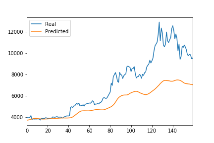
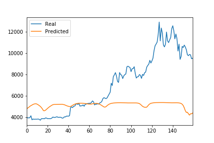

# Unit 14 Deep Learning

In this assignment, I will use deep learning recurrent neural networks to model bitcoin closing prices. One model will use the FNG indicators to predict the closing price while the second model will use a window of closing prices to predict the nth closing price.

# Prepare the data for training and testing

For the Fear and Greed model, I have used the FNG values to try and predict the closing price. 

For the closing price model, I have used previous closing prices to try and predict the next closing price. 

Each model I have used 70% of the data for training and 30% of the data for testing.

A MinMaxScaler was applied to the X and y values to scale the data for the model.

Finally, I reshape the X_train and X_test values to fit the model's requirement.

# Build and train custom LSTM RNNs

I have created the same custom LSTM RNN architecture for each model. In Fear and Greed model, I have fitted the data using the FNG values. In the closing price model, I have fitted the data using only closing prices.

Use the same parameters and training steps for each model.

# Model Performance Evaluation

### Which model has a lower loss?

The closing price model has a lower loss of 0.0964 compared to a loss of 0.2365 from Fear and Greed model.

### Which model tracks the actual values better over time?

## Closing Price model

## Fear and Greed  Model

The Closing Price model tracks the actual values better over time.

### Which window size works best for the model?

A 10 day window size works best for Closing Price model.

A 2 day window size works best for Fear and Greed model because it has a loss value of 0.1659 compared to a loss value of 0.2365 from a 10 day window size.
